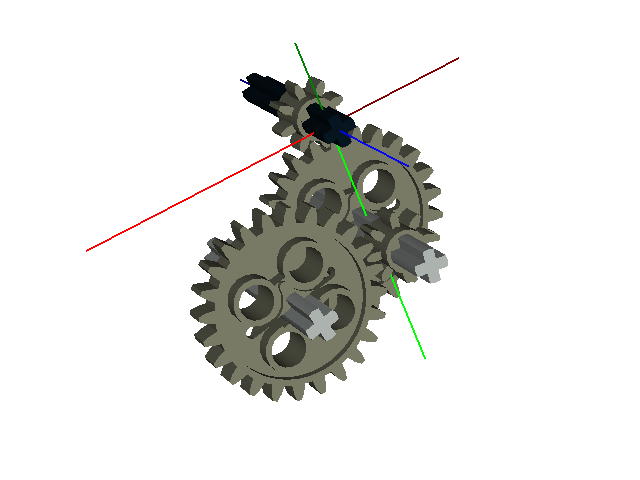

Animation Example
=================

How to create animations using OpenSDraw. Useful ideas about how to configure LDView for this purpose can be found `here <http://www.holly-wood.it/ldview-en.html>`_.

Step 1
------

Create the lcad file.

.. literalinclude:: ./../../opensdraw/examples/gears.lcad
   :lines: 6-

.. note::

   **time-index** is the animation variable. It will count up from 0 in increments of 1.

.. note::
   
   This is the *gears.lcad* file in the examples folder.
   
Step 2
------

Create a directory to save the .dat files in, change to this directory and generate the dat files. ::

  cd opensdraw/examples
  mkdir animate
  cd animate
  python ../../scripts/lcad_to_ldraw.py ../gears.lcad gears.mpd 100

.. note::

   This will make 100 different versions of the gears.dat file (time-index = 0..99).

Step 3
------

Generate the png files in the same directory. ::

  python ../../scripts/ldview_render.py ./

.. note::

   Edit the options in *ldview_render.py* depending on the desired results (point of view, background color, etc..)

Step 4
------

Create a movie. I find `ImageJ <http://fiji.sc/Fiji>`_ be a handy tool for this. You can import the series of .png files as an image sequence (File -> Import -> Image Sequence).

See Also
--------

The chain.lcad example, which demonstrates animating a chain and sprocket system.
