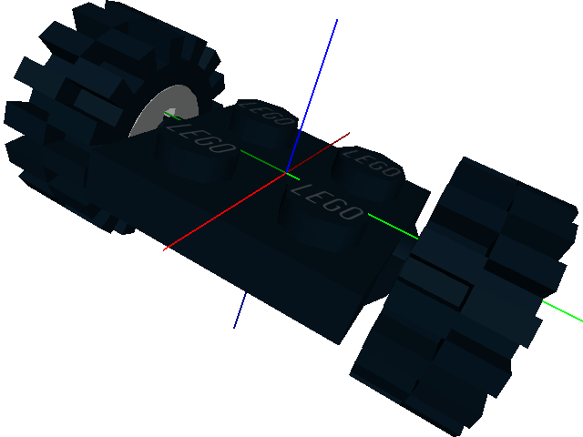
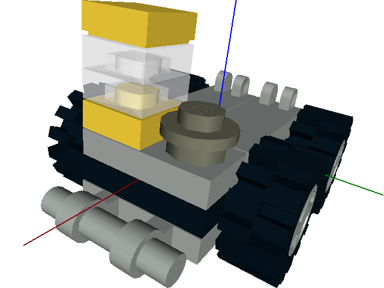
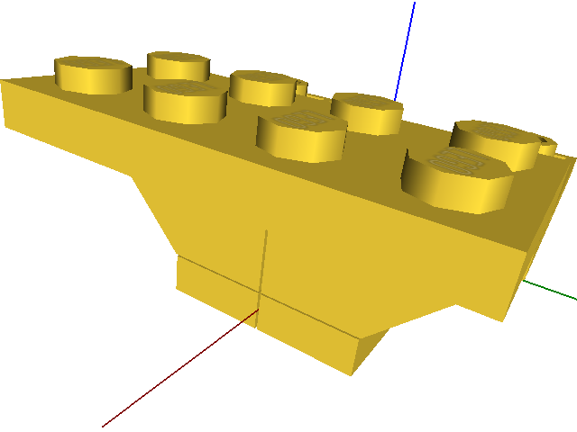
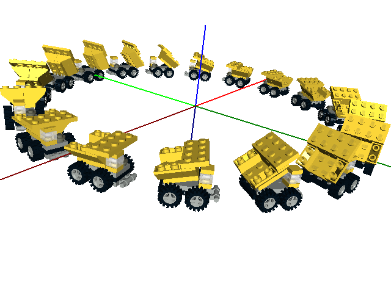

Dumper Truck Example
====================

This recreates the Dumper Truck example from `here <http://www.holly-wood.it/mlcad/basic1-en.html>`_
using OpenLDraw.

Step 1
------

Import the *locate* library for easier part placement. ::

  (import locate :local)

Step 2
------

Create the wheel assembly. ::

   (def wheel-assembly ()
    (block

     ; A. Plate 2 x2 with Wheel Holders.
     (sb 0 0 0 -90 90 0 "4600" "Black")

     ; B. Wheel Rim 6.4 x 8.
     (sb 0 1.5 -0.2 90 0 0 "4624" "Light_Gray")

     ; C. Tyre 6/50 x 7 Offset Tread.
     (sb 0 1.5 -0.2 90 0 0 "3641" "Black")

     ; D. Mirror above along the y-axis to add the other wheel and tyre.
     (mirror (0 1 0)
      (sb 0 1.5 -0.2 90 0 0 "4624" "Light_Gray")
      (sb 0 1.5 -0.2 90 0 0 "3641" "Black"))

     ))

.. note::

   The arguments for the **sb()** function (standard brick) are x, y, z position in bricks, x-axis, y-axis, z-axis rotation in degrees, LDraw part number, part color.
   
.. note::

   You can use either numbers or names for part colors.

Step 3
------

Create the truck body. ::

  (def truck-body ()
   (block
  
    ; A. Wheel assembly
    (translate ((bw -1) 0 0)
     (wheel-assembly))

    (translate ((bw 1) 0 0)
     (wheel-assembly))

    ; B. Plate 1 x 2.
    (sb -1.5 0 0.33 -90 90 0 "3023" "Light_Gray")

    ; C. Hinge Tile 1 x 2 with 2 Fingers.
    (sb 0 0.5 0.66 -90 0 0 "4531" "Light_Gray")
    (sb 0 -0.5 0.66 -90 0 0 "4531" "Light_Gray")

    ; D. Plate 1 x 1.
    (sb -1.5 0.5 0.66 -90 90 0 "3024" "Yellow")
    (sb -1.5 0.5 1.0 -90 90 0 "3024" "Trans_Clear")
    (sb -1.5 0.5 1.33 -90 90 0 "3024" "Trans_Clear")

    ; E. Tile 1 x 1 with Groove.
    (sb -1.5 0.5 1.66 -90 90 0 "3070b" "Yellow")

    ; F. Plate 1 x 1 Round.
    (sb -1.5 -0.5 0.66 -90 90 0 "4073" "Dark_Gray")

    ; G. Plate 1 x 2 with Handle.
    (sb -1.5 0 -0.33 -90 -90 0 "2540" "Light_Gray")

    ))

.. note::

   The **bw()** function converts brick widths to LDU (LDraw units).

Step 4
------

Create the dumper assembly. ::

  (def dumper-assembly ()

   ; Make (0,0,0) the pivot point.
   (translate ((bw -1.5) 0 (bh 0.15))
  
    ; A. Hinge Plate 1 x 2 with 3 Fingers and Solid Studs.
    (sb 0 0.5 0.0 -90 0 0 "4275b" "Yellow")
    (sb 0 -0.5 0.0 -90 0 0 "4275b" "Yellow")

    ; B. Slope Brick 45 2 x 1 Inverted.
    (sb -0.5 -0.5 1 -90 0 0 "3665" "Yellow")
    (sb -0.5 0.5 1 -90 180 0 "3665" "Yellow")

    ; C. Slope Brick 45 4 x 2 Double Inverted with Open Center.
    (sb 1 0 1 -90 0 0 "4871" "Yellow")

    ; D. Plate 2 x 4.
    (sb -1 0 1.33 -90 90 0 "3020" "Yellow")

    ))

.. note::

   The **bh()** function converts brick heights to LDU (LDraw units).

Step 5
------

Put everything together with a tilt option. ::

  (def truck (tilt)
   (block
  
    ; A. Truck body.
    (truck-body)

    ; B. Dumper assembly.
    (translate ((bw 1.5) 0 (bh 0.5))
     (rotate (0 (- tilt) 0)
      (dumper-assembly)))
  
    ))

.. figure:: dumper-truck4.png
   :align: center
   :scale: 50%

Step 6
------

Draw a ring of 18 trucks with different tilts. ::

  (for (i 18)
   (rotate (0 0 (* i 20))
    (translate (0 (bw 20) 0)
     (truck (* 30.0 (+ 1 (cos (/ (* i 40 pi) 180))))))))

.. note::

   The complete code for this example is in the examples folder (dumper-truck.lcad).
