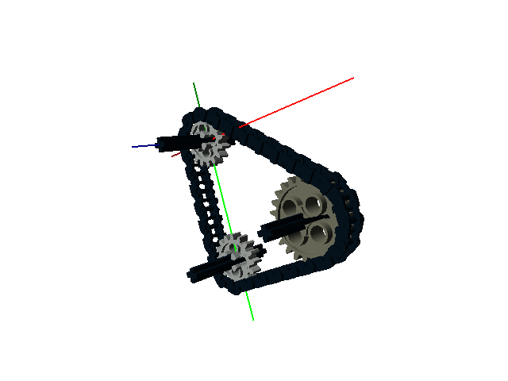
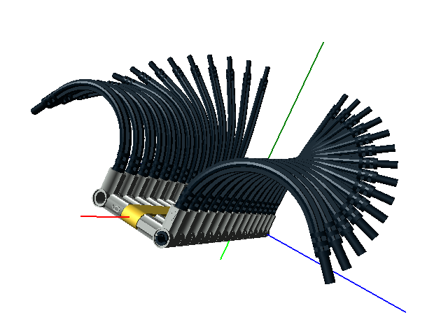
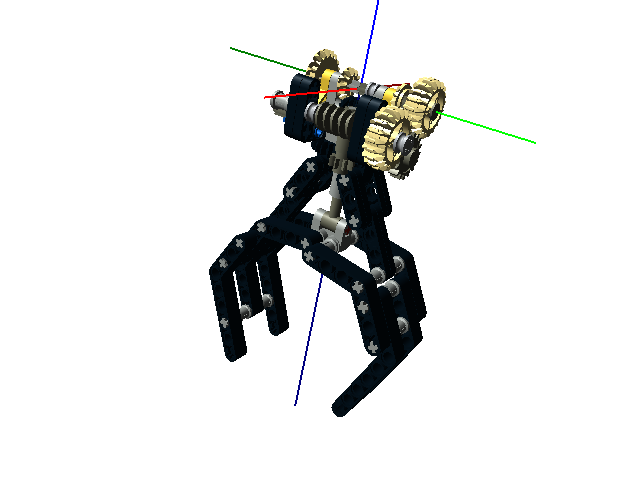
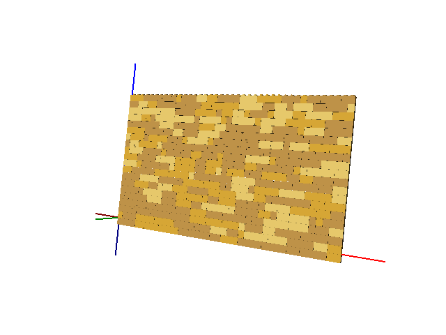

Summary of the Examples
=======================

All of the example can be found in the *examples* directory.

1. *auto-step.lcad* - An automatic build steps example.
2. *chain.lcad* - Chain and sprocket system creation and animation.

3. *curve.lcad* - Curve creation example.

4. *dumper-truck.lcad* - The Dumper Truck example from `here <http://www.holly-wood.it/mlcad/basic1-en.html>`_ using OpenLDraw.
5. *gears.lcad* - An animation example.

.. figure:: gears_00001.png
   :scale: 50%

6. *gripper.lcad* - A gripper, original design by Efferman from `here <http://www.brickshelf.com/cgi-bin/gallery.cgi?i=5724663>`_.

7. *steps.lcad* - A build steps example.
8. *wall.lcad* - A random number generator example.

