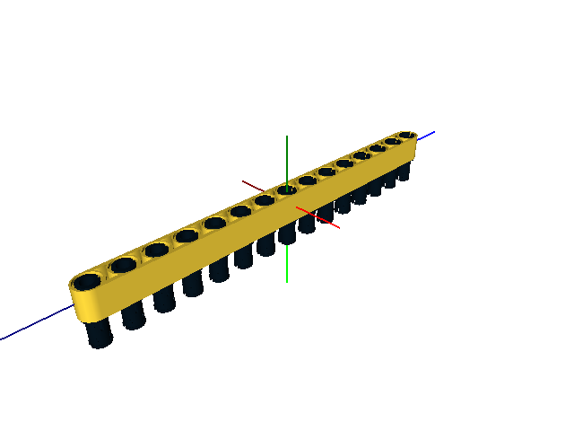
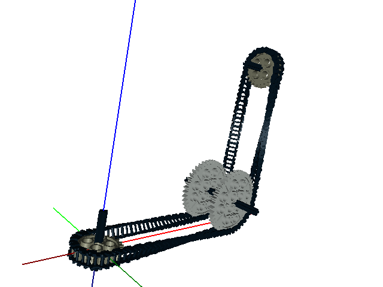
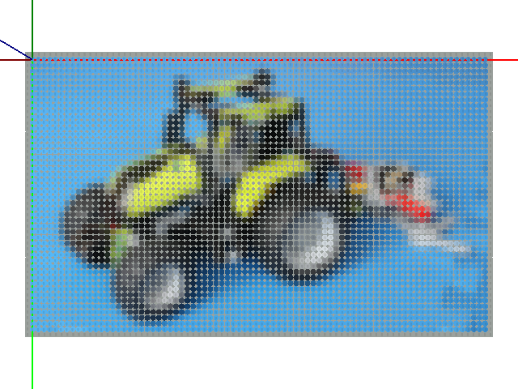
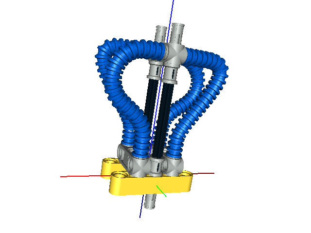
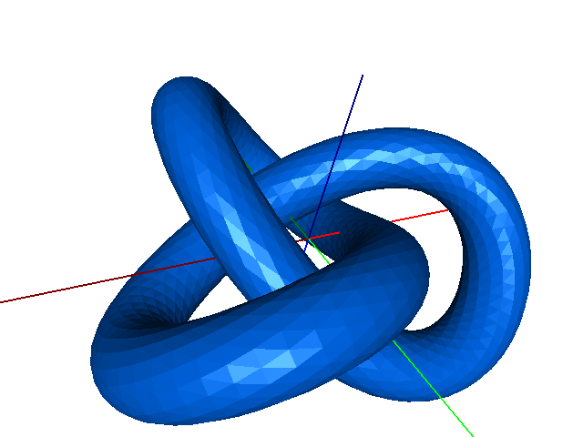

Summary of the Examples
=======================

All of the examples can be found in the *examples* directory.

1. *auto-step.lcad* - An automatic build steps example.

2. *belt.lcad* - 3D chain and sprocket system creation and animation.

3. *chain.lcad* - 2D chain and sprocket system creation and animation.

.. figure:: chain.png
   :scale: 50%

4. *curve.lcad* - Curve creation example.

.. figure:: curve.png
   :scale: 50%

5. *dumper-truck.lcad* - The Dumper Truck example from `here <http://www.holly-wood.it/mlcad/basic1-en.html>`_.

.. figure:: dumper-truck5.png
   :scale: 50%

6. *gears.lcad* - An animation example.

.. figure:: gears_00001.png
   :scale: 50%

7. *gripper.lcad* - A gripper, original design by Efferman from `here <http://www.brickshelf.com/cgi-bin/gallery.cgi?i=5724663>`_.

.. figure:: gripper.png
   :scale: 50%

8. *picture.lcad* - Interfacing with Python example.

9. *rib-hose.lcad* - Curves and ribbed-hose example.

10. *steps.lcad* - A build steps example.

.. figure:: step20.png
   :scale: 50%

11. *trefoil.lcad* - A LDraw primitives example.

12. *wall.lcad* - A random number generator example.

.. figure:: wall.png
   :scale: 50%

