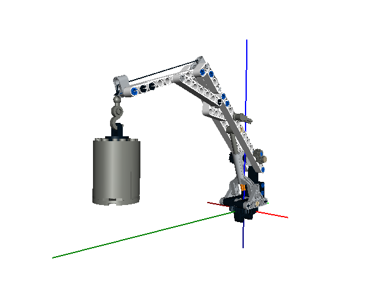
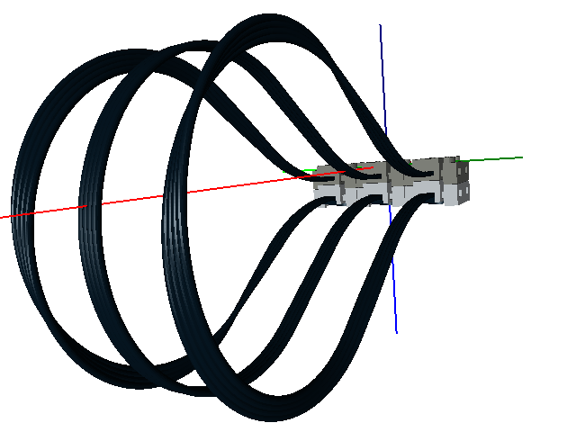
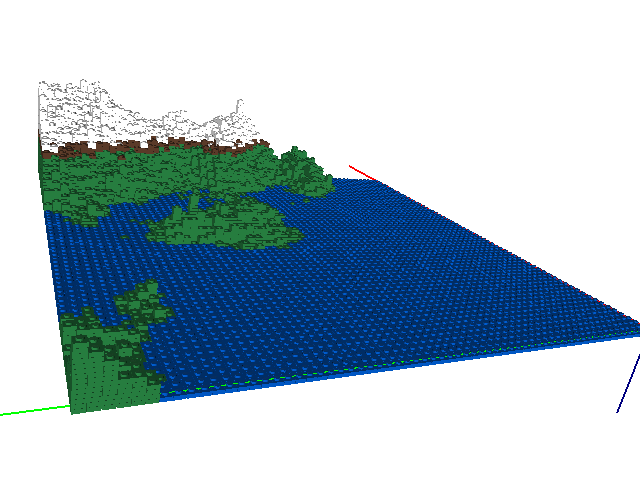
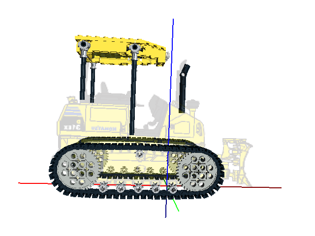
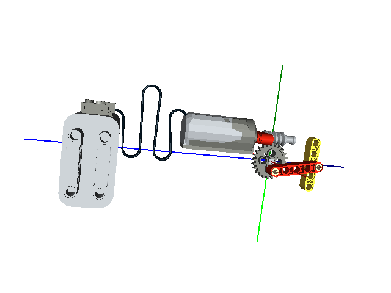
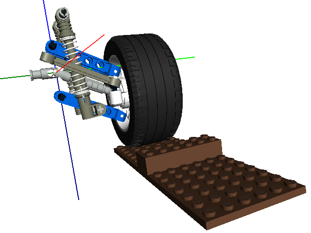

Summary of the Examples
=======================

All of the examples can be found in the *examples* directory.

1. *artic-truck-crane.lcad* - Pulley system creation and animation.

2. *auto-step.lcad* - An automatic build steps example.

.. figure:: auto-step.png
   :scale: 50%

3. *belt.lcad* - 3D chain and sprocket system creation and animation.

.. figure:: belt.png
   :scale: 50%

4. *callback.lcad* - Using callbacks to add twist to a curve function.

      
5. *chain.lcad* - 2D chain and sprocket system creation and animation.

.. figure:: chain.png
   :scale: 50%

6. *curve.lcad* - Curve creation example.

.. figure:: curve.png
   :scale: 50%

7. *dumper-truck.lcad* - The Dumper Truck example from `here <http://www.holly-wood.it/mlcad/basic1-en.html>`_.

.. figure:: dumper-truck5.png
   :scale: 50%

8. *gears.lcad* - An animation example.

.. figure:: gears_00001.png
   :scale: 50%

9. *gripper.lcad* - A gripper, original design by Efferman from `here <http://www.brickshelf.com/cgi-bin/gallery.cgi?i=5724663>`_.

.. figure:: gripper.png
   :scale: 50%

10. *landscape.lcad* - Create a model from a simple space delimited text file.

11. *overlay.lcad* - Overlay pictures / blueprints for model scaling.
	       

	   
12. *picture.lcad* - Interfacing with Python example.

.. figure:: picture.png
   :scale: 50%

13. *power-functions-cable.lcad* - 4 Wire power functions cable creation and animation.

	   
14. *rib-hose.lcad* - Curves and ribbed-hose example.

.. figure:: rib-hose.png
   :scale: 50%

15. *steps.lcad* - A build steps example.

.. figure:: step20.png
   :scale: 50%

16. *suspension.lcad* - A spring creation and animation example.

17. *trefoil.lcad* - A LDraw primitives example.

.. figure:: trefoil.png
   :scale: 50%

18. *wall.lcad* - A random number generator example.

.. figure:: wall.png
   :scale: 50%

