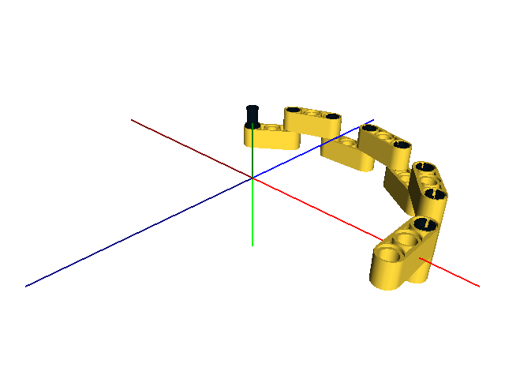
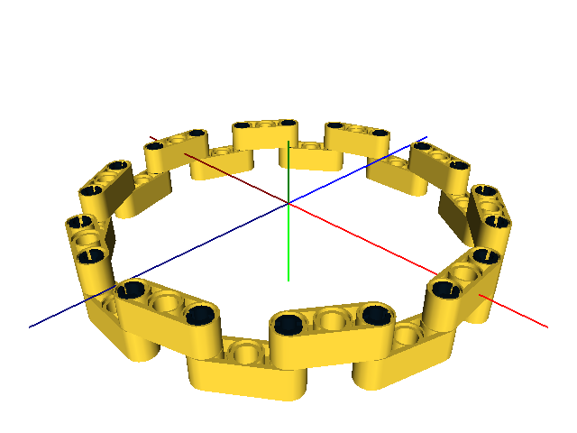

Build Steps Example
===================

How to add build step information to your model using OpenLDraw.

Step 1
------

Import the *ldu* conversion library. ::

  (import ldu :local)

Step 2
------

Create the .lcad file. ::

  (for (i 20)
   (rotate (0 (* i (/ 360.0 20)) 0)
    (translate ((bw 6.3) (if (= (% i 2) 0) 0 (bw 1)) 0)
     (part "32523" 14 i)))

   (rotate (0 (+ (* i (/ 360.0 20)) (* 0.5 (/ 360.0 20))) 0)
    (translate ((bw 6.4) (bw 0.5) 0)
     (rotate (0 0 90)
      (part "3673" "black" i)))))

.. note::

   The **part()** function takes an optional third argument which is the build step number.

.. note::

   The step number does not have to be an integer, floating point numbers (and even strings) are also accepted. Steps are ordered using the Python **sorted()** function.

.. note::

   We don't use the *locate* library functions **sbs()** or **tbs()** because we want to rotate first, then translate.

Step 3
------
Convert the .lcad file to a .dat file using *lcad_to_ldraw.py*. ::
  
  cd openldraw/examples
  python ../lcad_to_ldraw.py steps.lcad steps.dat

Step 4
------
Load the .dat file with your favorite viewer (LDView renderings shown here).

   Step 8

   Step 20

.. note::

   The complete code for this example is in the examples folder (steps.lcad).
